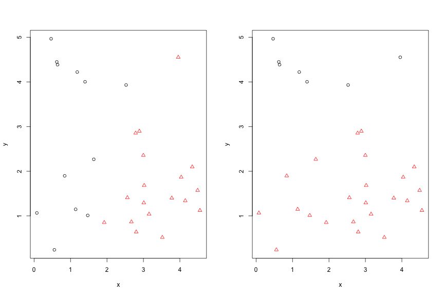
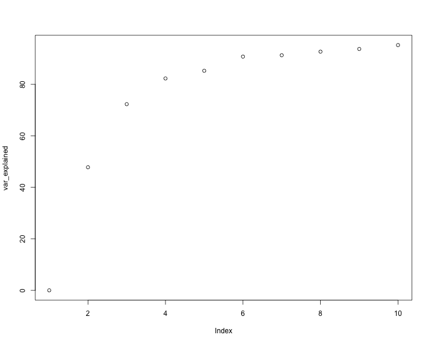
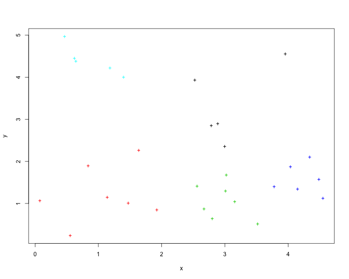
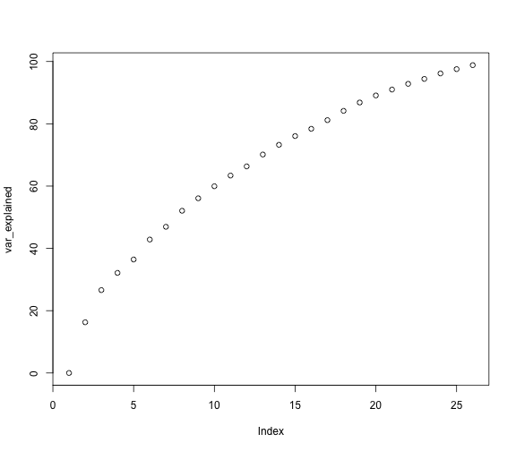
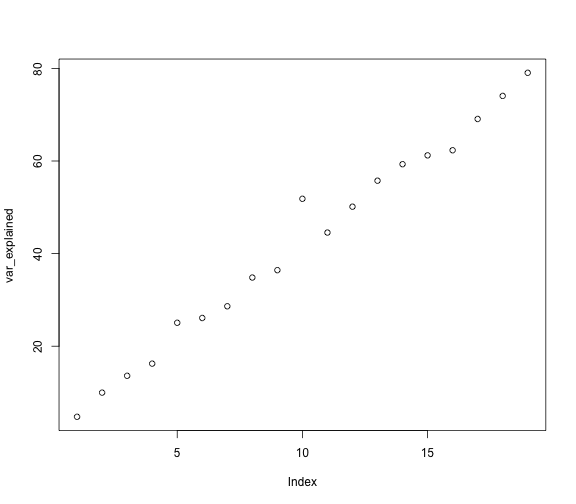

* create test input

```r
set.seed(3)
weights <- read.csv("output.csv", header = FALSE)
kmTestInput <- data.frame(x = runif(30, max = 5), y = runif(30, max = 5))
# write.csv(km$cluster, 'kmTestOutput.csv', row.names = FALSE, quote =
# FALSE) write.csv(kmInputTest, 'kmTestInput.csv', row.names = FALSE, quote=
# FALSE)
```
* compare different starting points

```r
set.seed(1)
km1 <- kmeans(kmTestInput, 2)
set.seed(45)
km2 <- kmeans(kmTestInput, 2)
par(mfrow = c(1, 2))
plot(kmTestInput, pch = km1$cluster, col = km1$cluster)
plot(kmTestInput, pch = km2$cluster, col = km2$cluster)
```

 
* sum of squares decomposition


```r
withinSS <- function(dat, km_object) {
    # dat = k-means input matrix/dataframe km_object = object of class kmeans
    # returns total within group sum of squares
    
    dat$cluster <- km_object$cluster
    
    within_ss <- 0
    
    for (c in 1:length(unique(dat$cluster))) {
        s2c <- 0
        for (i in 1:ncol(dat[, names(dat) != "cluster"])) {
            s2c <- s2c + sum((dat[dat$cluster == c, i] - mean(dat[dat$cluster == 
                c, i]))^2)
        }
        within_ss <- within_ss + s2c
    }
    return(within_ss)
}

betweenSS <- function(dat, km_object) {
    # dat = k-means input matrix/dataframe km_object = object of class kmeans
    # returns between group sum of squares
    
    dat$cluster <- km_object$cluster
    
    between_ss <- 0
    
    for (c in 1:length(unique(dat$cluster))) {
        d <- 0
        for (i in 1:ncol(dat[, names(dat) != "cluster"])) {
            d <- d + (mean(dat[dat$cluster == c, i]) - mean(dat[, i]))^2
        }
        between_ss <- between_ss + (d * sum(dat$cluster == c))
    }
    return(between_ss)
}

explainedSS <- function(dat, km_object) {
    # dat = k-means input matrix/dataframe km_object = object of class kmeans
    # returns total sum of squares
    
    100 * betweenSS(dat, km_object)/(betweenSS(dat, km_object) + withinSS(dat, 
        km_object))
}
```
* variance explained

```r
explainedSS(kmTestInput, km1)
```

```
## [1] 43.28807
```

```r
100 * betweenSS(kmTestInput, km1)/(betweenSS(kmTestInput, km1) + withinSS(kmTestInput, 
    km1))  # percentage of variance explained
```

```
## [1] 43.28807
```

```r
var_explained <- numeric()

for (i in 1:10) {
    km <- kmeans(kmTestInput, i)
    var_explained <- c(var_explained, 100 * km$betweenss/km$totss)
}

plot(var_explained)  ## looks like 5 is optimal
```

 

```r
plot(kmTestInput, col = kmeans(kmTestInput, 5)$cluster, pch = "+")
```

 

* using the shakespeares weights matrix

```r
var_explained <- numeric()

for(i in 1:(nrow(weights)-1)) {
    km <- kmeans(weights, i)
    var_explained <- c(var_explained, 100 * km$betweenss/km$totss)
}

plot(var_explained)
```

 

```r
require(skmeans)
```

```
## Loading required package: skmeans
```

```r
var_explained <- numeric()

for(i in 2:20) {
    print(i)
    km <- skmeans(as.matrix(weights), i)
    var_explained <- c(var_explained, explainedSS(weights, km))
}
```

```
## [1] 2
## [1] 3
## [1] 4
## [1] 5
## [1] 6
## [1] 7
## [1] 8
## [1] 9
## [1] 10
## [1] 11
## [1] 12
## [1] 13
## [1] 14
## [1] 15
## [1] 16
## [1] 17
## [1] 18
## [1] 19
## [1] 20
```

```r
plot(var_explained)
```

 
